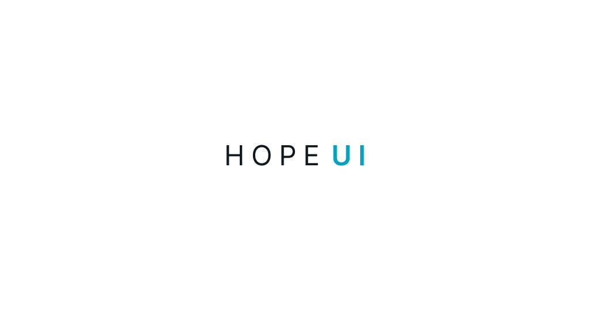

  

<h1 align="center">🤞 The SolidJS component library you've hoped for</h1>

  
  
  
  

Hope UI is a composable and accessible component library that gives you the foundation to build your next SolidJS application.

## Project status

Hope UI is still under development and is not ready for production.

## Documentation

For full documentation, visit [hope-ui.com](https://hope-ui.com/).

## Acknowledgment

This project is inspired by :

- [Chakra UI](https://chakra-ui.com/)
- [Mantine](https://mantine.dev/)

## Contributors ✨

Thanks goes to these wonderful people ([emoji key](https://allcontributors.org/docs/en/emoji-key)):

<!-- ALL-CONTRIBUTORS-LIST:START - Do not remove or modify this section -->
<!-- prettier-ignore-start -->
<!-- markdownlint-disable -->
<table>
  <tr>
    <td align="center"><a href="https://github.com/fabien-ml"> <b>Fabien MARIE-LOUISE</b></a> <a href="#design-fabien-ml" title="Design">🎨</a> <a href="https://github.com/fabien-ml/hope-ui/commits?author=fabien-ml" title="Code">💻</a> <a href="https://github.com/fabien-ml/hope-ui/commits?author=fabien-ml" title="Documentation">📖</a> <a href="#maintenance-fabien-ml" title="Maintenance">🚧</a></td>
  </tr>
</table>

<!-- markdownlint-restore -->
<!-- prettier-ignore-end -->

<!-- ALL-CONTRIBUTORS-LIST:END -->

This project follows the [all-contributors](https://github.com/all-contributors/all-contributors) specification. Contributions of any kind welcome!

## License

This project is licensed under the MIT License.
